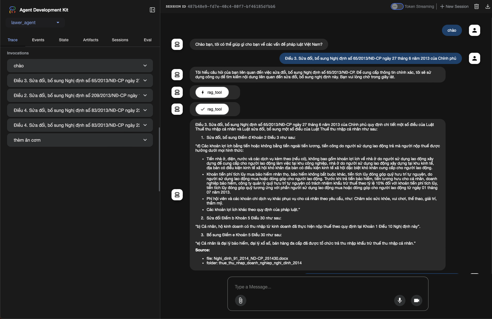

# Hierarchical LAWER AGENTIC RAG

> Hệ thống Agentic RAG phân cấp cho tài liệu pháp luật: truy xuất chính xác, có ngữ cảnh, có nguồn gốc.

---
<p align="center">
  
</p>


## 🔰 Tổng quan

Hệ thống gồm nhiều tầng (layers) để **ingest → index → search → re-rank → trả lời** cho tập tài liệu pháp luật có cấu trúc phân cấp (Bộ, Ngành, Lĩnh vực, Văn bản…).

> **Mục tiêu**: Đảm bảo truy xuất chính xác thông tin pháp luật với đầy đủ **ngữ cảnh** và **nguồn gốc đáng tin cậy**.

---

## 🏗 Kiến trúc tổng thể

```
📁 Data Layer ──▶ ⚙️ Processing Layer ──▶ 🔍 Indexing Layer ──▶ 💾 Storage Layer ──▶ 🔎 Search & Retrieval ──▶ ❓ Query Processing
         (files)          (extract, chunk)         (embed, dual)          (ChromaDB)              (hybrid, MFR)            (context, answer)
```

* **Hierarchical Context**: Duy trì cấu trúc folder → document → chunk để không mất ngữ cảnh.
* **Dual-level Indexing**: Index **folder-level** và **document-level** song song.
* **Authority-based Ranking**: Ưu tiên văn bản có hiệu lực, nguồn tin cậy, cập nhật mới.

---

## 📁 Data Layer (Tầng Dữ liệu)

* **Cấu trúc folder** phân cấp chứa documents pháp luật.
* **`meta.json`** trong mỗi folder: cung cấp thông tin tổng quan (cấp, cơ quan ban hành, lĩnh vực, phạm vi, thời hiệu…).
* **Files nguồn**: PDF/DOC/DOCX/TXT chứa nội dung luật.

**Ví dụ cấu trúc thư mục**

```
law_documents/
└── thue_gia_tri_gia_tang_nghi_dinh_2013/
    ├── meta.json
    ├── 2019_ND-ABC_Huong-dan-… .pdf
    └── 2021_TT-XYZ_Sua-doi-… .docx
```

**Ví dụ `meta.json`**

```json
{
  "description": "Thuế giá trị gia tăng 2013",
  "legal_domain": "Nghịs định",
  "keywords": ["2013", "nghị định", "thuế giá trị gia tăng"],
  "last_updated": "2024-01-15",
  "parent_folder": null
}
```

---

## ⚙️ Processing Layer (Tầng Xử lý)

* **Text Extraction**: Trích xuất text từ nhiều định dạng (PDF/DOC/DOCX/TXT).
* **Metadata Loading**: Load thông tin từ `meta.json` ở từng cấp folder.
* **Document Chunking**: Chia documents thành **chunks** phù hợp (theo độ dài & ranh giới ngữ nghĩa).
* **Enhanced Text Creation**: Tạo **representations** giàu ngữ cảnh (thêm context từ folder metadata).

---

## 🔍 Indexing Layer (Tầng Đánh chỉ mục)

* **Dual-level indexing**: Index **folder** *và* **document** (chunk) để phục vụ các loại truy vấn khác nhau.
* **SentenceTransformer**: Dùng model embedding để tạo vector representations.
* **Hierarchical structure**: Lưu & tham chiếu **cấu trúc phân cấp** trong index (folder → document → chunk).

**Gợi ý model**

```yaml
embedding:
  model: sentence-transformers/all-MiniLM-L6-v2
  normalize: true
  batch_size: 64
```

---

## 💾 Storage Layer (Tầng Lưu trữ)

* **ChromaDB Collections**: Lưu trữ embeddings + metadata.
* **Folder Collection**: Cho **folder-level search**.
* **Document Collection**: Cho **document chunk search**.
* **Cache**: Tối ưu hiệu suất truy xuất & hợp nhất kết quả lặp.

**Ví dụ tên collection**

```yaml
storage:
  chroma:
    path: ./.chroma
    collections:
      folder: thue_gia_tri_gia_tang_nghi_dinh_2013
      document: legal_documents
  cache:
    enabled: true
    ttl_seconds: 86400
```

---

## 🔎 Search & Retrieval Layer (Tầng Tìm kiếm)

* **Hybrid Search**: Kết hợp **folder search** (định hướng chủ đề/ngữ cảnh) + **document search** (chi tiết nội dung).
* **Multi-Factor Re-ranking (MFR)**: Chấm điểm dựa trên nhiều yếu tố (similarity, authority, time, diversity…).
* **Diversity Filtering**: Đảm bảo kết quả đa dạng, tránh trùng lặp chunk.

**Pipeline tóm tắt**

1. Tìm **folder candidates** → 2) Tìm **document chunks** liên quan → 3) Hợp nhất → 4) **Re-rank** đa yếu tố → 5) Lọc đa dạng.

---

## 📊 Scoring System (Hệ thống Điểm số)

* **Document Similarity (70%)**: Độ liên quan nội dung chunk / document.
* **Folder Relevance (20%)**: Độ liên quan theo ngữ cảnh folder.
* **Authority Score (10%)**: Độ tin cậy (ngày hiệu lực, status, cơ quan ban hành…)

**Công thức (ví dụ)**

```text
final_score = 0.70 * doc_similarity
             + 0.20 * folder_relevance
             + 0.10 * authority_score
```

---

## ❓ Query Processing Layer (Tầng Xử lý Truy vấn)

* **Context Building**: Tập hợp các **relevant chunks** kèm metadata (nguồn, trích dẫn, trích yếu…).
* **Answer Generation**: Sinh trả lời **có nguồn gốc** (trích dẫn văn bản, link/file, đoạn điều khoản).
* **Related Documents**: Gợi ý văn bản liên quan (cùng lĩnh vực, sửa đổi, thay thế, hết hiệu lực…).


---

## ✨ Advanced Features (Tính năng Nâng cao)

* **Hierarchical Context**: Hiểu & bảo toàn cấu trúc phân cấp pháp luật.
* **Legal Domain Classification**: Phân loại theo lĩnh vực pháp lý.
* **Cross-Document Relations**: Phát hiện liên hệ giữa văn bản (sửa đổi/bổ sung/thay thế).
* **Temporal Relevance**: Ưu tiên văn bản mới và còn hiệu lực.
* **Authority-based Ranking**: Xếp hạng theo độ tin cậy của văn bản & cơ quan ban hành.

---

## 🚀 Quickstart

### Yêu cầu

* Python ≥ 3.10
* `pip` hoặc `poetry`

### Cài đặt & Chạy

```bash
# 1. Clone dự án
git clone <https://github.com/KhoanDoanVan/law_agentic_rag>
cd law_agentic_rag

# 2. Tạo virtual environment
python3 -m venv .venv
source .venv/bin/activate   # Linux/Mac

# 3. Cài đặt dependencies
pip3 install -r requirements.txt

# 4. Tạo file .env và thêm GOOGLE_API_KEY. LƯU Ý: src/core/agent/lawer_agent/.env
GOOGLE_GENAI_USE_VERTEXAI=FALSE
GOOGLE_API_KEY=YOUR_API_KEY
```

### Chạy truy vấn thử bằng CLI

```bash
cd src
python3 __main__.py
```

---


### Chạy hỏi đáp thử bằng giao diện ADK

```bash
cd src/agent
adk web
```

---

### Dự án học tập nhẹ nhàng, nếu thấy hay có mình xin 1 star nhé :)
